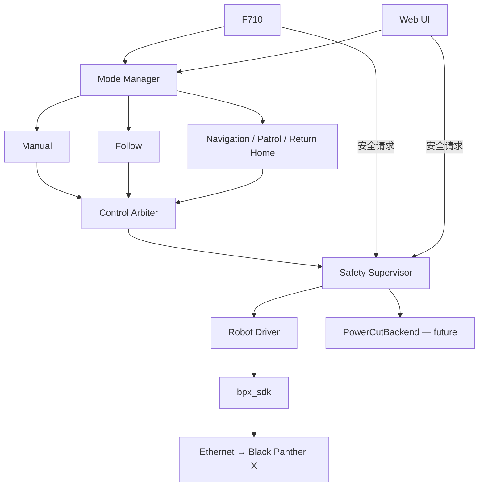

# GuideRobotDog 最终架构基线

日期：2026-09-09。本文是用户已批准的目标设计，**不是完整实现或实机验收声明**。
本次只做 Phase A：架构基线与 L2 Serial 迁移准备。

## 当前实现与目标的边界

已有 Web、F710、本机 HTTP API、ControlService、MockRobotAdapter 与
MymoooRobotAdapter。F710 不直接调用 SDK；`robotdog-gamepad.service` 启动待命控制器。
ControlService 已有 3 秒控制权租约、300 ms 运动 TTL、软件锁定和异常停止。
`server.py` 的 `mode=mock/bpx` 是后端选择，不能当成 OperatingMode。

完整 Mode Manager、Control Arbiter、SafetyState、PowerCutBackend 均尚未实现。
现有 `/api/estop` 是只锁定的急停入口，F710 B 使用该入口；旧的
`/api/action` 的 `estop` 动作仍有切换解锁语义。后者与目标 RESET/ARM 分离设计
存在差距，下一阶段需迁移并验证，本阶段保留运行代码和现有测试。
现有软件调用成功也不能证明机器人实际停止或进入阻尼。

## Raspberry Pi 5B 硬件拓扑

```text
Raspberry Pi 5B
├── eth0 ── Ethernet ── Black Panther X / Mymooo（10.21.20.1）
├── USB ── Unitree UART→USB Adapter ── TTL UART ── Unitree L2
├── USB ── Logitech F710 Receiver
├── USB3 ── Camera（后续）
├── GPIO / Safety Controller ── Relay / Contactor（后续）
└── wlan0 ── Wi-Fi / 手机热点 / AP ── Web UI、SSH
```

Robot Ethernet 与管理 Wi-Fi 分离；不为 L2 的最终部署增加第二张网卡。
管理地址随部署确定，不写入私人管理网信息。本文不执行任何网络配置。
L2 目标设备名为 `/dev/unitree_l2`；当前 VID/PID、序列号、USB 拓扑及实际 tty
名称均 UNKNOWN。不得把 `/dev/ttyACM0` 当成永久标识。

## 控制数据流与职责



- F710 与 Web：选择模式、人工控制及安全操作；均不绕过安全层。
- Mode Manager：检查模式前提、启动/取消行为；切换时使旧指令失效，禁止旧目标恢复运动。
- Control Arbiter：在当前模式下选择唯一有效指令来源，检查控制权、时间戳和命令寿命；
  模式切换、人工接管或来源失联先撤销旧来源并停止，再允许显式启用新来源。
- Safety Supervisor：拥有运动放行权；急停不等待控制权租约或导航取消完成，
  先锁定并输出零速度，再异步取消行为、请求阻尼并记录结果。取消失败保持锁定。
- Robot Driver：唯一 SDK 运动边界；传递零速度/阻尼、记录错误，不把调用返回当成物理反馈。

## OperatingMode 与 SafetyState 正交

| OperatingMode | 目标职责 |
|---|---|
| STANDBY | 无运动输出，等待显式选择/启用 |
| MANUAL_GAMEPAD | F710 人工运动 |
| MANUAL_WEB | Web 人工运动 |
| FOLLOW | 目标跟随 |
| NAVIGATION | 到达指定目标 |
| PATROL | 按巡逻任务运行 |
| RETURN_HOME | 返回已定义的安全归航目标 |

| SafetyState | 目标语义 |
|---|---|
| SAFE | 未武装，禁止运动 |
| ARMED | 允许满足模式、来源、健康和寿命条件的运动 |
| SOFT_ESTOP | 软件急停锁定；计算、感知和机器人供电保留 |
| HARD_ESTOP | 已确认动力支路切断，运动仍锁定 |
| FAULT | 故障锁定，记录原因；不能自动恢复 |

禁止 `mode=ESTOP`。例如 `mode=FOLLOW, safety=ARMED` 可正常跟随；软急停后为
`mode=FOLLOW, safety=SOFT_ESTOP`，模式上下文可留作显示，但当前跟随任务和目标必须取消。
确认硬件断电后可为 `mode=FOLLOW, safety=HARD_ESTOP`。
模式选择不隐含 ARM；RESET 清理满足恢复前提的锁定至 SAFE，随后须显式 ARM。
恢复不自动重放运动或重启旧自主目标。FAULT/HARD_ESTOP 的解除还需故障消除和硬件反馈。

避障是 FOLLOW、NAVIGATION、PATROL、RETURN_HOME 共用的底层能力，
不是同级产品主模式。将来可单独设计 AVOIDANCE_TEST，但不属于本阶段。

## 两种急停

SOFT_ESTOP：立即禁止非零速度及可产生运动的动作，输出零速度并请求安全/阻尼状态；
取消 autonomous behavior、Nav2 goal、Follow、Patrol，记录触发来源、原因、时间及失败。
Pi、L2、Web、F710 保持运行，机器狗仍上电，显式 RESET/ARM 后才可恢复。
F710 B 的最终名称是 SOFT_ESTOP，不是断电急停。

HARD_ESTOP：通过后续 GPIO / Safety Controller → Relay / Contactor 切断
机器人执行机构/动力支路。零速度、Python 退出或系统 shutdown 都不能替代此能力。

```text
Robot Battery
├── Safety Relay / Contactor ── Robot drive power
├── DC-DC 5V ── Raspberry Pi 5
└── DC-DC 12V ── Unitree L2
```

这是待硬件确认的供电设计；电压、电流容量、布线和隔离需按实际设备审查。
目标是硬急停后仅 Robot drive power OFF，Pi/L2/Web/F710 继续 ON，能显示状态并记录故障。

未来 PowerCutBackend 默认必须为 UnavailablePowerCutBackend。无硬件配置时请求返回
`hardware_power_cut_unavailable`，不能显示成功、动力 OFF 或已确认 HARD_ESTOP。
仍需保持软件运动锁定并明确显示断电未确认；后续硬件实现也必须区分“请求已发送”与
“断电反馈已确认”，超时/失败保留故障。仅软件回执不足以确认断电。

GPIO 引脚、有效电平、继电器型号与反馈线路均 UNKNOWN，本阶段没有接口代码或 GPIO 操作。
未来 Web 分设“停止运动 / SOFT E-STOP”和“切断动力 / HARD E-STOP”；后者需长按。
F710 的 LB+RB+B 持续约 1.5 秒只是待评审示例，本阶段不实现。
Web/F710 发出的 HARD_ESTOP 是远程 power-cut request；实体蘑菇急停必须有独立硬件
安全链路，不依赖 Linux、Python、网络或 USB。

## L2 感知与未来自主链路

```text
Unitree L2 → UART → USB Adapter → Linux serial device
  → official SDK2 Serial API → PointCloud + IMU
  → timestamp validation → ROS2 Driver → Point-LIO → Nav2
  → Follow / Navigation / Patrol / Return Home → Control Arbiter → Safety
Camera（后续）→ target perception → Follow
```

目标 `work_mode=8`（Standard FOV、3D、IMU enabled、Serial、上电自启），
实际当前模式 UNKNOWN；历史 Ethernet 实测读回为 0。
普通 bringup、driver、diagnostics 和启动脚本不得写工作模式。
若未来需要切换，只能另建 `l2_set_transport_once` 一次性工具，经用户明确授权人工执行；
Phase A 不创建或运行该工具。完整接入步骤与验收表见 [L2 README](L2_README.md)。

原生 Serial 点云、IMU、10 秒时间戳窗口、至少 60 秒稳定性、退出和 USB 重连
均验收通过后，才评审进入 ROS2。Ethernet 约 0.5 倍时钟及 closeUDP 缺陷是
[历史证据](L2_PHASE2_REPORT.md)，不能直接套用到 Serial，也不能假定已消失。
安装外参未测量，禁止发布虚假的零 TF；点云/IMU 原点差异需按官方坐标定义处理。

## 阶段路线图（后续均未实施）

| 阶段 | 交付与进入条件 |
|---|---|
| Phase A | 本文、Serial 目标配置、接入指南、只读发现、不可安装 udev 示例；提交后停审 |
| Proposed Phase B | 经审查后做 Pi 串口身份确认及受控 SDK Serial 运行验收；模式不符则停止，另行授权一次性切换 |
| 控制安全阶段 | 单独设计并实现 Mode Manager / Arbiter / SafetyState；先用 mock 验证急停、超时、切换、RESET/ARM；默认硬断电不可用 |
| 感知定位阶段 | Serial 验收通过后 ROS2 Driver、标定与 Point-LIO；验证时间、坐标、QoS |
| 自主阶段 | Nav2 与共用避障，随后 Navigation / Patrol / Return Home；感知与目标定义就绪后 Follow |
| 硬件安全阶段 | 独立审查并验收动力断电链路及实体急停，再考虑远程硬急停 UI/按键 |

任何真实运动、固件/永久配置、网络变更及动力断电测试均需单独明确授权。
